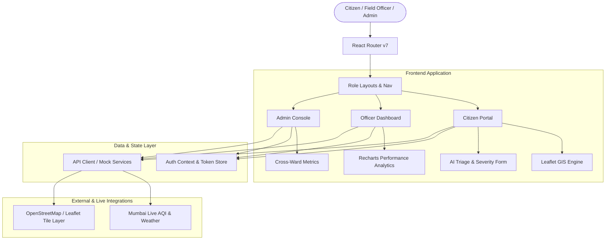

<div align="center">

# 🏛️ KAISER AI
### *AI-Powered Civic Grievance & Municipal Resolution Platform for Mumbai*

[](https://react.dev/)
[](https://vitejs.dev/)
[](https://tailwindcss.com/)
[](https://leafletjs.com/)
[](#license)

<p align="center">
  <b>Empowering Citizens. Streamlining Municipal Wards. Accelerating Resolution.</b><br />
  Built for Mumbai’s 26 Municipal Wards (BMC) with intelligent automated triage, live geospatial mapping, and role-tailored dashboards.
</p>

[Explore Features](#-key-features) • [Quick Start](#-quick-start) • [Role Portals](#-role-portals) • [Architecture](#-architecture) • [Demo Credentials](#-default-demo-credentials)

---

</div>

## 📌 Executive Summary

**Kaiser AI** is a next-generation municipal governance platform engineered to bridge the gap between citizens and urban municipal bodies (Brihanmumbai Municipal Corporation - BMC). 

By leveraging **AI classification**, **severity scoring**, and **geospatial routing**, Kaiser AI eliminates manual triage bottlenecks and automatically directs citizen grievances—ranging from severe road potholes to dangerous open drainage and streetlight failures—directly to the responsible ward engineers with time-bound SLA tracking.

---

## 🌟 Key Features

### 👤 1. Citizen Portal (`/app`)
- **Smart Grievance Filing**: AI-assisted complaint registration with auto-categorization and severity prediction (0–100 scale).
- **Interactive Live Map**: Leaflet-powered GIS map visualizing verified civic issues, colored by severity and category pins across Mumbai.
- **My Complaints Tracker**: Track resolution milestones in real time (`Submitted` ➔ `Assigned` ➔ `In Progress` ➔ `Resolved`).
- **Live Environmental Barometer**: Real-time ambient weather, humidity, and Mumbai AQI integration to contextualize seasonal civic hazards like monsoon waterlogging.

### 👷 2. Ward Officer Portal (`/officer`)
- **Triage & Dispatch Desk**: Filter grievances by municipal ward (e.g., K/E Andheri, G/N Bandra, Worli) and priority level.
- **Workflow State Management**: One-click actions to acknowledge, schedule, update status, and close complaints with resolution notes.
- **Performance & SLA Monitoring**: Live tracking of average turnaround time, overdue violations, and target resolution quotas.
- **Visual Analytics**: Interactive Recharts breakdown of complaint categories and weekly resolution throughput.

### 🏛️ 3. City Administrator Console (`/admin`)
- **BMC Command Center**: Macro-level view of grievance inflow across all 26 Mumbai wards.
- **Ward Performance Heatmaps**: Comparative analytics highlighting top-performing wards and zones lagging behind SLAs.
- **Officer & Resource Roster**: Manage field officers, reallocate workloads, and audit departmental bottlenecks.
- **One-Click Audit Reports**: Export summary metrics for municipal executive briefings.

---

## 🏗️ Architecture & Tech Stack



| Layer | Technology | Purpose |
| :--- | :--- | :--- |
| **Framework** | **React 19** + **Vite 8** | Ultra-fast client-side SPA with lightning HMR |
| **Styling** | **Tailwind CSS v4** | Modern design system, custom palettes, glassmorphism |
| **Icons** | **Lucide React** | Clean, consistent SVG iconography |
| **Mapping** | **Leaflet** + **React-Leaflet** | Interactive geospatial issue clustering & ward mapping |
| **Charts** | **Recharts** | Smooth SVG-based data visualizations and KPI trends |
| **Routing** | **React Router v7** | Client routing with multi-tier nested layouts |
| **Forms & Validation** | **React Hook Form** + **Zod** | Type-safe form handling and validation |
| **Alerts & Toasts** | **React Hot Toast** | Non-intrusive feedback notifications |

---

## 🚀 Quick Start

### Prerequisites
- **Node.js**: v18.0.0 or higher
- **npm** or **pnpm** / **yarn**

### 1. Clone & Install
```bash
# Clone the repository
git clone https://github.com/your-username/hikari.git
cd hikari

# Install dependencies
npm install
```

### 2. Environment Configuration
Create a `.env` file in the root directory (refer to `.env.example`):
```env
VITE_API_URL=http://localhost:5000/api
VITE_WEATHER_API_KEY=your_openweather_key
VITE_GOOGLE_CLIENT_ID=your_google_oauth_client_id
```

### 3. Run Development Server
```bash
npm run dev
```
The app will spin up locally at `http://localhost:5173`.

### 4. Build for Production
```bash
npm run build
npm run preview
```

---

## 🔑 Default Demo Credentials

For quick local evaluation without setting up an external backend database, use the pre-configured role presets on the **[Sign In](/login)** page:

| Role | Preset Email | Password | Assigned Scope |
| :--- | :--- | :--- | :--- |
| **Citizen** | `citizen@kaiser.gov.in` | `password123` | Individual Submissions & Ward 1 |
| **Ward Officer** | `officer@kaiser.gov.in` | `password123` | K/E Ward (Andheri East) Queue |
| **BMC Administrator** | `admin@kaiser.gov.in` | `password123` | City-Wide Access (All 26 Wards) |

*(You can also click the quick-fill role tabs directly on the `/login` screen)*

---

## 📁 Project Structure

```
Hikari/
├── public/                  # Static assets & favicon
├── src/
│   ├── api/                 # API service clients & mock data endpoints
│   │   ├── analytics.api.js # City & ward statistics
│   │   ├── auth.api.js      # Authentication & Google OAuth
│   │   ├── complaints.api.js# Grievance CRUD & GIS coordinates
│   │   └── weather.api.js   # AQI and meteorology feeds
│   ├── components/
│   │   ├── common/          # Reusable UI primitives (Button, Card, Badge, Modal, Input)
│   │   ├── complaints/      # Grievance cards, status pills, category icons
│   │   ├── layout/          # Public, Citizen, Officer, and Admin shell layouts
│   │   └── map/             # Leaflet mapping components and markers
│   ├── context/
│   │   └── AuthContext.jsx  # Global session, JWT restore, and role switching
│   ├── pages/
│   │   ├── LandingPage.jsx  # Public marketing hero, live ticker & emergency hotline
│   │   ├── AuthPage.jsx     # Multi-role authentication & registration
│   │   ├── CitizenPages.jsx # Citizen dashboard, report form, my complaints, map
│   │   ├── OfficerPages.jsx # Ward triage queue & officer KPIs
│   │   └── AdminPages.jsx   # City-wide macro analytics & ward leaderboards
│   ├── utils/
│   │   ├── formatters.js    # Date, time, currency, and string sanitizers
│   │   └── mockData/        # Seed datasets for complaints, wards, and officers
│   ├── App.jsx              # Application route tree
│   └── main.jsx             # React DOM root entry
├── package.json
├── tailwind.config.js
└── vite.config.js
```

---

## 🛣️ Features & Roadmap

- [x] **Multilingual Support (Marathi, Hindi, English)**: Complete UI localization across portals with persistent preference.
- [x] **Live Notifications Center & Drawer**: Interactive notifications panel with unread badges, mark-as-read, and real-time grievance dispatch alerts.
- [x] **GPS Auto-Locate & Draggable Pin Map**: Device geolocation, OpenStreetMap reverse-geocoding, nearest municipal ward auto-detection, and interactive Leaflet pin picker.
- [ ] **AI Duplicate Detection & Geo-clustering** to merge identical neighborhood reports.
- [ ] **Citizen "Me Too" Upvoting** to amplify urgent neighborhood concerns.
- [ ] **Before/After AI Photo Verification** to validate officer resolution authenticity.
- [ ] **WhatsApp Grievance Bot Integration** for zero-friction reporting on mobile.

---

## 📄 License

This project is licensed under the [MIT License](LICENSE).
